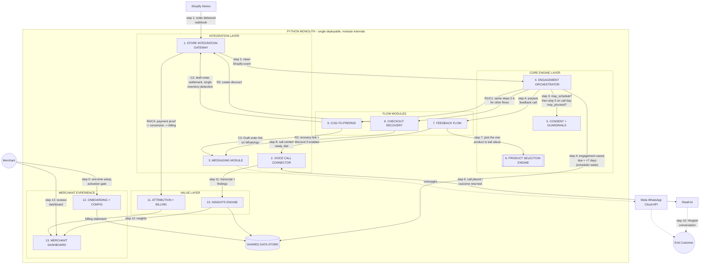
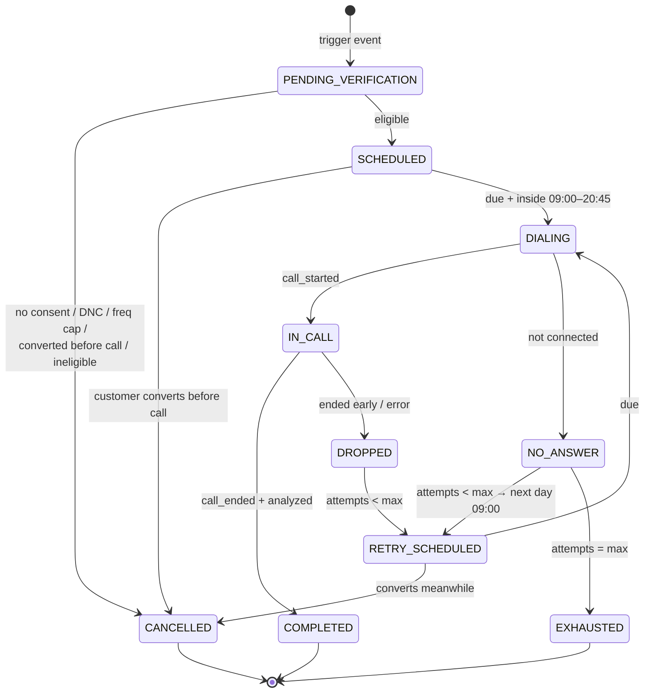

# Technical Specification — AI Voice Agent for Shopify Customer Engagement

**Status:** Draft v0.2 — open questions resolved into a Decision Log (§2)
**Owner:** TBD
**Last updated:** 2026-08-14
**Changes from v0.1:** All 26 open questions answered. Major changes: public OAuth Shopify app; checkout opt-in consent gate; COD→prepaid via Shopify draft orders (payment-link provider dropped); per-merchant WABA; Hinglish single workflow; strict billing-grade attribution; **no holdout group**; flat fee + revenue-share pricing → billing ledger added; feedback flow targets one product via a value+recency scoring heuristic, default 7 days post-delivery.

---

## 1. Context & Scope

The PRD defines three MVP flows, all one shape: **Shopify event → eligibility & scheduling → Retell voice call → follow-up actions (WhatsApp + discount / payment link) → structured outcomes → merchant insights & billing.**

The Retell workflows (the conversational layer) already exist. **This spec covers everything around them**: the Python backend that ingests Shopify events, gates on consent, schedules and triggers calls, handles retries, executes post-call actions, extracts insights, attributes conversions, computes billing, and serves the merchant dashboard.

Out of scope: prompt design inside Retell, dashboard frontend implementation, Shopify app-store listing copy.

### 1.1 The three flows (final MVP parameters)

| Flow | Trigger | Call timing (default, per-merchant configurable) | Retries on no-answer | Frequency cap | In/post-call actions                                                                                                                                                 | Billable outcome |
|---|---|---|---|---|----------------------------------------------------------------------------------------------------------------------------------------------------------------------|---|
| Abandoned Checkout | Checkout w/ phone + consent, no order after delay | 45 min after last checkout activity | 1 retry, **next day's window** | 1 call / customer / 7 days | Understand reason → mid-call discount creation → WhatsApp with personalized msg + discount URL                                                                       | Discount code redeemed |
| COD → Prepaid | Order created with COD gateway | 15 min after order | 1 retry, **next day's window** | **None** — every COD order qualifies | Confirm intent → pitch prepaid → **Shopify draft-order invoice link (have a discount or promocode)** via WhatsApp (optional discount)                                | Draft order paid |
| Post-Purchase Feedback | Order delivered (fulfillment event; fallback shipped+N) | **7 days** after delivery | **0 retries** | 1 call / customer / 7 days; targets **one product chosen by scoring heuristic** | Structured feedback only (CSAT, quality, expectations, delivery, complaints)                                                                                         | — (insight product, covered by flat fee) |

**Calling window:** 09:00–21:00, merchant store timezone (IST for the pilot). Hard cutoff — no dial after 20:45. Events maturing outside the window queue to the next window open.
**Language:** single **Hinglish** workflow per flow. No per-customer language routing in MVP.
**Volume assumption:** < 200 calls/day at pilot. Single API service + single worker + one Postgres is sufficient.

---

## 2. Decision Log

Resolved decisions (D#) with their design consequences, followed by the short list still open.

### 2.1 Resolved

| # | Decision | Consequence in this spec                                                                                                                                                                                                                                                                                                      |
|---|---|-------------------------------------------------------------------------------------------------------------------------------------------------------------------------------------------------------------------------------------------------------------------------------------------------------------------------------|
| D1 | **Public OAuth Shopify app from day one** | OAuth install flow + token storage per shop; mandatory GDPR webhooks (`customers/data_request`, `customers/redact`, `shop/redact`); **Protected Customer Data approval** needed to read phone numbers — apply early, it gates everything (§8.2). App review timeline added to plan.                                           |
| D2 | **Discounts: fixed % per flow, merchant-configured** | No in-call negotiation; `flow_configs.discount_percent`; agent script promises exactly one offer.                                                                                                                                                                                                                             |
| D3 | **Compliance posture: pilot with explicit checkout opt-in consent** | Consent captured at checkout (checkout UI extension checkbox or cart attribute) Is this provided by Shopify or not? ; `customers.consent_at/consent_source` stored; **no consent → no engagement created**. Consent doubles as WhatsApp opt-in. DND scrub still recommended as belt-and-braces (Phase 0 legal check remains). |
| D4 | **Call timing defaults**: abandoned 45 min; COD 15 min; feedback **7 days** post-delivery — all per-merchant configurable | `flow_configs.trigger_delay_minutes`. 7-day feedback delay gives real product-usage signal; trade-off: colder recall on delivery questions. Candidate for later A/B.                                                                                                                                                          |
| D5 | **Retry: next day's window. Calling window 09:00–21:00** (store TZ) | Scheduler computes `next_action_at = next window open` on no-answer; 20:45 last-dial rule.                                                                                                                                                                                                                                    |
| D6 | **Hinglish, single workflow per flow** | One Retell workflow ID per flow; language config dropped from MVP.                                                                                                                                                                                                                                                            |
| D7 | **Frequency caps per flow**: COD uncapped; abandoned 1/7d; feedback 1/7d + product scoring | Cap check in eligibility, enforced via `customers.last_engaged_at` per flow (see `engagement` uniqueness + eligibility query, §5).                                                                                                                                                                                            |
| D8 | **Pricing: flat fee + % of recovered value** (abandoned recoveries + COD conversions) | Attribution is **billing-grade**: strict rules, auditable artifacts, merchant-visible. New `billing_ledger`; conversions feed invoices. Per-call cost still tracked internally for our own unit economics, not for billing.                                                                                                   |
| D9 | **COD→prepaid via Shopify draft order / invoice link** | No external payment-link provider. New reconciliation obligation: when draft order is paid, **cancel the original COD order** and link the two (§8.2.3). Inventory double-hold between link-sent and paid/expired.                                                                                                            |
| D10 | **Delivered detection: `fulfillment_events` (delivered), fallback shipped + N days** | Fallback N per merchant (default 5). Both paths produce the same internal `order_delivered` event.                                                                                                                                                                                                                            |
| D11 | **Per-merchant WABA (merchant's own number)** | WhatsApp onboarding = part of merchant onboarding (Meta embedded signup or token handover); template approval per merchant per flow; messaging layer is multi-WABA.                                                                                                                                                           |
| D12 | **Attribution: strict** — discount-code redemption or draft-order paid, nothing else | No fuzzy 72h order-matching. Undercounts organic recoveries; every billed rupee has a hard artifact. `conversions.attribution_rule ∈ {code_redemption, draft_order_paid}`.                                                                                                                                                    |
| D13 | **No holdout group** | HOLDOUT state removed from the state machine. Dashboard reports recovery counts and rates, **not causal lift**. Risk logged (§12): merchants may ask "would they have returned anyway?" — strict attribution is the partial answer. Schema keeps an unused `is_holdout` flag for painless reintroduction.                     |
| D14 | **Volume: < 200 calls/day pilot** | Minimal infra (§9); no partitioning/Temporal discussions until >10k/day.                                                                                                                                                                                                                                                      |
| D15 | **DNC scope: per-merchant** | `customers.do_not_call` scoped to merchant. A customer opting out of store A can still be called by store B.                                                                                                                                                                                                                  |
| D16 | **One dedicated outbound number per merchant** | Number provisioning in onboarding; number stored on `merchants`; caller-ID consistency with the store improves answer rates; enables per-merchant truecaller-style business identity later.                                                                                                                                   |
| D17 | **Feedback product scoring: simple heuristic — order value + recency** | `score = w1·normalized_line_item_value + w2·recency_decay(delivered_at)`; computed at trigger time over the customer's delivered items in the last 30 days; top-scoring product becomes the call subject (stored in `engagements.source_snapshot.feedback_target`). No new table needed; weights in `flow_configs.extra`.     |
| D18 | **Cost accounting: internal only** | `calls.cost_estimate` retained for unit economics; not exposed in billing.                                                                                                                                                                                                                                                    |

### 2.2 Still open (parked in Phase 0, none block schema/HLD)

1. **AI + recording disclosure wording** in the agent's opening line (legal to confirm; assume required). Need to check this one. Not sure of the actual legal flow for this. 
2. **Data retention** confirm: recordings 90 days, transcripts 1 year. I dont think we get the actual call recording from the retell. We can get the transcript. How much to store them needs to be checked. 
3. **COD gateway detection** — validate `payment_gateway_names` values across pilot merchants' checkout setups. Not clear what this means.
4. **Retell plan concurrency limit** — measure; dispatcher throttle set below it.
5. **Consent capture UX** — checkout UI extension vs. cart-attribute checkbox; depends on merchants' checkout type (Checkout Extensibility vs. legacy). This consent needs to checked. We will need the consent for call and whatssap message.
6. **Meta embedded-signup feasibility** for per-merchant WABA vs. manual onboarding for pilot. Nope this is totally not needed. We will ensure the person themselves provide us with a WABA verified number to register. 
7. **Invoice cadence & revenue-share %** — commercial, needed before Phase 4 billing UI.
8. **Draft-order edge cases** — shipping charges, COD fees, partial payments, discounts interaction (validate on a dev store, Phase 0).

---

## 3. Approach Analysis — Key Design Decisions

### 3.1 Event detection: hybrid webhooks + reconciliation (unchanged from v0.1)

Webhooks are primary: `checkouts/create|update`, `orders/create|paid|cancelled`, `fulfillments/update`, `fulfillment_events/create`, `app/uninstalled`, plus the three mandatory GDPR topics. Shopify fires **no "checkout abandoned" webhook** — abandonment is *derived*: on checkout activity we schedule a check at `T + delay`; when it fires we verify no order exists for the checkout token. A 15–30 min reconciliation poller repairs missed webhooks. `orders/create` cancels any pending abandoned-checkout engagement for its token — and, for COD orders, *creates* a COD engagement in the same handler. Why do we want on the app uninstalled? We have something provided by shopify for the abandoned checkouts: https://shopify.dev/docs/api/admin-rest/latest/resources/abandoned-checkouts. This link needs to be checked ones for proper implementation. 

### 3.2 Scheduling & orchestration: Postgres state machine + worker queue (unchanged)

Postgres is the source of truth (`engagements.state`, `next_action_at`); a scheduler tick claims due rows with `FOR UPDATE SKIP LOCKED` and pushes execution to Celery/Dramatiq workers. Cancellation = row update. Long-delay timers (the 7-day feedback wait!) live in the DB, not in Redis ETAs — this is exactly the case where broker-based delays go wrong. Portable to Temporal later without data-model changes. At <200 calls/day (D14) a 30s tick is more than enough.

**Window math (D5):** when an engagement matures outside 09:00–21:00 store time, `next_action_at` is set to the next 09:00. No-answer retry sets `next_action_at = next day 09:00` (plus per-merchant jitter to avoid a 9am thundering herd of retries).

### 3.3 Discount creation: mid-call via Retell custom function (unchanged)

The agent calls `POST /fn/create-discount` only when the conversation reaches the offer step; backend creates the single-use, customer-scoped, expiring code and enqueues the WhatsApp send, returning an ack the agent can speak (<2s budget). Post-call handler is the fallback if the function fails. Codes existing **only when offered** is now doubly important: redemption is a *billing event* (D8, D12). There is no discount code which is being created. The way we plan to do this for the abandoned checkout and the COD to online payments events is that we (the agent) will take confirmation from the user and ones the user agress the agent will be responsible to fire an API call to out backend.This backend call will be responsibel to get the discount promo codes (either they could be DB fetch or made on the fly this needs to come from research in the shopify). Then an personalised whatssap message is sent to the end user.  

### 3.4 Insight extraction: two layers (unchanged)

Layer 1 — Retell post-call structured fields per workflow (operational signal, drives actions). Layer 2 — our own async LLM pass over the transcript producing merchant-facing `call_insights` with a stable taxonomy, re-runnable/backfillable. Hinglish transcripts (D6) are handled fine by the Layer-2 model; taxonomy labels stay English.

### 3.5 WhatsApp: Meta Cloud API, per-merchant WABA (updated per D11)

Each merchant brings (or we provision) their own WABA + number. Consequences: (a) onboarding includes embedded signup / token handover + template submission per flow; (b) our `MessagingProvider` layer keys every send by `merchant_id → waba_id, phone_number_id, token`; (c) template approval status is tracked per merchant — **a flow cannot be enabled until its template is approved** (enforced in `flow_configs`). Consent from D3 satisfies WhatsApp's opt-in expectation. This is sure the merchant needs to provide the WABA number.  

### 3.6 COD→prepaid mechanics: Shopify draft order (updated per D9)

When the customer agrees on-call, the agent fires `POST /fn/create-payment-link`: we create a **draft order** mirroring the COD order (line items, discounts, shipping; minus COD fee if configured), send its `invoice_url` via WhatsApp, and track payment through `orders/create`/`orders/paid` for the draft-order-completed order. On payment: **cancel the original COD order** (restock=false, note linking to the new order), tag both, write the conversion. If the invoice isn't paid within an expiry window (default 24h), delete the draft order and release inventory. The duplicate-order window is the main operational risk (§12) — merchant ops must be briefed that a paid draft order supersedes the COD original. We are not sure of the name of the API call that is responsble for the COD to prepaid flow. We want to create a draft order corresponding to the COD. This draft order shall have all the details plus the agreed upon discount and then the link is shared via WA to the end user. We need to have an asynchronous job to run after sometime to know the status of the draft order if it is paid then we cancel/remove/delete the COD order or we need to cancel/remove/delete the draft order and continue with the COD ones. This async job ensures final sanity is always ensured in the flow.

*Rejected alternatives:* external payment link (Razorpay) — clean UX but reconciliation to Shopify order state is manual and billing-grade attribution gets weaker; cancel-and-recreate before payment — customer may pay nothing and the original order is already gone.

### 3.7 One generic engine, config-driven flows (unchanged)

`flow_configs` per (merchant, flow_type): Retell workflow ID, delay, retries, window, discount %, WhatsApp template, scoring weights (feedback), draft-order expiry (COD). A future fourth flow (e.g., NDR/failed-delivery calls) is configuration + one trigger handler.

---

## 4. High-Level Design

### 4.1 Component overview



### 4.2 Flow Journey

```mermaid
flowchart LR
    subgraph P1["PHASE 1 - MERCHANT ONBOARDING (shared, one-time)"]
        direction TB
        A1["Merchant installs app<br/>via Shopify"] --> A2["Save store credentials +<br/>subscribe to store events<br/>incl. data-privacy compliance"]
        A2 --> A3["Merchant provides business profile<br/>+ WhatsApp Business (WABA) details"]
        A3 --> A4["Link merchant's WABA +<br/>approve message templates<br/>(one per flow)"]
        A3 --> A5["Assign dedicated<br/>outbound calling number"]
        A5 --> A6["Set up voice workflows in Retell<br/>(one per flow)<br/>on the merchant's number"]
        A7["Merchant configures each flow:<br/>timings, frequency caps,<br/>discount toggle ON/OFF + %<br/>(recovery link and COD conversion),<br/>draft order expiry, calling hours,<br/>working days"] --> AG
        A4 --> AG{"ACTIVATION GATE per flow:<br/>store connected, number assigned,<br/>template approved,<br/>workflow ready"}
        A6 --> AG
        AG -- all ready --> A8["Merchant ACTIVE -<br/>enabled flows go live"]
        AG -- anything pending --> A9["Not active yet -<br/>pending items shown<br/>to merchant"]
    end

    subgraph P2["PHASE 2 - EVENT DETECTION TO SCHEDULING"]
        direction TB
        B1["Store event received<br/>from Shopify"] --> B2["Validate and record<br/>the event"]
        B2 --> B3{"Event type?"}
        B3 -- "order delivered" --> B4["Identify customer +<br/>capture delivered products"]
        B4 --> B5["Schedule feedback call:<br/>7 days after delivery,<br/>working day, calling window"]
        B3 -- "checkout started with<br/>contact info, not completed" --> B6["Wait out abandonment window<br/>(default 45 min)"]
        B6 --> B7{"Purchase completed<br/>on its own meanwhile?"}
        B7 -- yes --> B8["No call needed -<br/>checkout self-recovered"]
        B7 -- no --> B9["Confirmed abandoned checkout -<br/>schedule recovery call<br/>within calling window"]
        B3 -- "order placed with<br/>Cash on Delivery" --> B11["Schedule COD conversion call:<br/>15 min after order,<br/>within calling window -<br/>every COD order qualifies"]
        B10["Safety net: periodically pull<br/>abandoned checkouts from Shopify<br/>to catch missed events"] -.-> B9
    end

    subgraph P3["PHASE 3 - CALL DAY: ELIGIBILITY + PREPARATION"]
        direction TB
        C1["Due calls picked up"] --> C2{"Eligibility checks:<br/>customer consented,<br/>not on do-not-call list,<br/>flow cap honoured<br/>(feedback + abandoned: 1 per 7d,<br/>COD: no cap)"}
        C2 -- fail --> C3["Call cancelled,<br/>reason recorded"]
        C2 -- pass --> C6{"Still relevant?<br/>abandoned: purchase not completed,<br/>COD: order still active,<br/>not cancelled or shipped"}
        C6 -- no longer relevant --> C3
        C6 -- yes --> C7{"Which flow?"}
        C7 -- feedback --> C4[["PRODUCT SELECTION ENGINE<br/>in: customer's recent deliveries<br/>(calls x carts x products)<br/>out: the one product<br/>to collect feedback on"]]
        C4 --> C5["Selected product recorded<br/>against the scheduled call"]
        C7 -- abandoned checkout --> C8["Cart contents + checkout<br/>recovery link prepared,<br/>discount applied if merchant<br/>enabled the toggle"]
        C7 -- COD conversion --> C9["COD order details prepared:<br/>items, amount, discount if<br/>merchant enabled the toggle"]
    end

    subgraph P4["PHASE 4 - CALL + OUTCOME"]
        direction TB
        D1["AI call placed from the<br/>merchant's number, personalised<br/>with customer, product, cart<br/>or order details"] --> D2(("Customer"))
        D2 --> D3{"Answered?"}
        D3 -- "no - feedback" --> D4["Marked missed -<br/>feedback calls not retried,<br/>no message sent"]
        D3 -- "no - abandoned or COD" --> D10{"First attempt?"}
        D10 -- yes --> D11["One retry scheduled for<br/>next working day,<br/>no message sent meanwhile"]
        D10 -- no --> D12["Marked missed -<br/>attempts exhausted,<br/>no message sent"]
        D3 -- yes --> D13{"Which flow?"}
        D13 -- feedback --> D5["Feedback conversation:<br/>satisfaction, product quality,<br/>expectations vs reality,<br/>delivery experience, complaints"]
        D13 -- abandoned --> D14["Understand reason<br/>for abandoning checkout"]
        D14 --> D15{"Willing to complete<br/>the purchase?"}
        D15 -- yes --> D16["Checkout recovery link<br/>(discount included if enabled)<br/>sent to customer's WhatsApp<br/>during the call"]
        D15 -- no --> D6
        D13 -- COD conversion --> D20["Confirm order intent +<br/>explain benefits of<br/>paying online"]
        D20 --> D21{"Agrees to pay online?"}
        D21 -- yes --> D22["Draft order created mirroring<br/>the COD order: items, shipping,<br/>discount if enabled, COD fee removed -<br/>draft holds NO inventory,<br/>stock stays with the COD order"]
        D22 --> D23["Draft order payment link<br/>sent to customer's WhatsApp<br/>during the call"]
        D21 -- no --> D6
        D23 --> D6["Call outcome received:<br/>transcript + structured findings"]
        D16 --> D6
        D5 --> D6
        D19["Any opt-out request honoured -<br/>customer added to<br/>do-not-call list"] -.-> D6
        D6 --> D7[("Outcome saved")]
        D7 --> D8["Engagement complete +<br/>insights on merchant dashboard"]
    end

    subgraph P5["PHASE 5 - CONVERSION SETTLEMENT (async)"]
        direction TB
        E1["Customer completes checkout<br/>via recovery link"] --> E2["Recovery recorded with proof -<br/>feeds billing (revenue share)"]
        E3["Sanity job checks every<br/>open draft order until settled<br/>(payment events as fast path)"] --> E4{"Draft order paid<br/>within expiry window<br/>(default 24h)?"}
        E4 -- paid --> E5["Immediately cancel original<br/>COD order with stock returned -<br/>new prepaid order keeps its<br/>deduction, so inventory is<br/>reduced exactly once -<br/>both orders tagged + cross-linked"]
        E5 --> E6["COD conversion recorded with<br/>proof - feeds billing<br/>(revenue share)"]
        E4 -- "not paid, or COD order<br/>cancelled or shipped meanwhile" --> E7["Draft order deleted -<br/>no inventory ever held by it -<br/>original COD order<br/>continues unchanged"]
    end

    A8 ==> B1
    B5 ==> C1
    B9 ==> C1
    B11 ==> C1
    C5 ==> D1
    C8 ==> D1
    C9 ==> D1
    D11 -.-> C1
    D16 -.-> E1
    D23 -.-> E3
```

---

## 5. Engagement State Machine



`max_attempts`: abandoned=2, COD=2, feedback=1 (config). HOLDOUT state removed (D13). Invariants unchanged from v0.1: every transition logged; cancellation races handled by re-checking state inside the DIALING claim transaction; post-call actions tracked independently in `actions`; idempotency via `(merchant_id, flow_type, source_ref)` uniqueness and webhook dedup.

**Eligibility check order (Event Processor):** consent present → phone valid E.164 → flow enabled + template approved → not DNC (per-merchant) → frequency cap for flow → (feedback only) scoring heuristic picks target product → create engagement.

---

## 6. Data Model (ERD) — v0.2

```mermaid
erDiagram
    MERCHANTS ||--o{ FLOW_CONFIGS : has
    MERCHANTS ||--o{ CUSTOMERS : has
    MERCHANTS ||--o{ ENGAGEMENTS : owns
    MERCHANTS ||--o{ BILLING_LEDGER : billed
    CUSTOMERS ||--o{ ENGAGEMENTS : "target of"
    FLOW_CONFIGS ||--o{ ENGAGEMENTS : configures
    ENGAGEMENTS ||--o{ CALLS : attempts
    ENGAGEMENTS ||--o{ ACTIONS : produces
    ENGAGEMENTS ||--o{ ENGAGEMENT_TRANSITIONS : logs
    ENGAGEMENTS ||--o| CONVERSIONS : "may yield"
    CONVERSIONS ||--o| BILLING_LEDGER : "creates entry"
    CALLS ||--o| CALL_INSIGHTS : yields
    ACTIONS ||--o| DISCOUNT_CODES : "may create"
    ACTIONS ||--o| DRAFT_ORDERS : "may create"
    ACTIONS ||--o| MESSAGES : "may send"
    MERCHANTS ||--o{ WEBHOOK_EVENTS : receives

    MERCHANTS {
        uuid id PK
        text shop_domain UK
        text access_token_enc "OAuth token (public app)"
        text name
        text timezone "store TZ, drives call window"
        text outbound_number "dedicated caller number (D16)"
        text waba_id "per-merchant WABA (D11)"
        text wa_phone_number_id
        text wa_token_enc
        text status "installing|active|uninstalled"
        numeric flat_fee_monthly
        numeric revenue_share_pct
        timestamptz installed_at
    }
    FLOW_CONFIGS {
        uuid id PK
        uuid merchant_id FK
        text flow_type "abandoned_checkout|post_purchase_feedback|cod_to_prepaid"
        bool enabled
        text retell_workflow_id "Hinglish workflow"
        int trigger_delay_minutes "45 / 15 / 10080 (7d)"
        int max_attempts "2 / 2 / 1"
        int call_window_start "9"
        int call_window_end "21"
        int freq_cap_days "7 / 0(none) / 7"
        numeric discount_percent
        text whatsapp_template_id
        text template_status "pending|approved|rejected"
        jsonb extra "scoring weights, draft_order_expiry_h, shipped_plus_n"
    }
    CUSTOMERS {
        uuid id PK
        uuid merchant_id FK
        text shopify_customer_id
        text phone_e164
        text name
        timestamptz consent_at "checkout opt-in (D3); null = never engage"
        text consent_source "checkout_extension|cart_attribute"
        bool do_not_call "per-merchant DNC (D15)"
        timestamptz last_engaged_abandoned "freq cap tracking"
        timestamptz last_engaged_feedback
    }
    ENGAGEMENTS {
        uuid id PK
        uuid merchant_id FK
        uuid customer_id FK
        uuid flow_config_id FK
        text flow_type
        text source_ref "checkout_token | order_id (UK w/ merchant+flow)"
        jsonb source_snapshot "items, value, feedback_target{product,score}"
        text state
        int attempt_count
        timestamptz next_action_at "partial index on active states"
        text cancel_reason
        bool is_holdout "always false in MVP; kept for future (D13)"
        timestamptz created_at
        timestamptz updated_at
    }
    ENGAGEMENT_TRANSITIONS {
        uuid id PK
        uuid engagement_id FK
        text from_state
        text to_state
        text reason
        jsonb meta
        timestamptz created_at
    }
    CALLS {
        uuid id PK
        uuid engagement_id FK
        text retell_call_id UK
        int attempt_number
        text status "dialing|connected|no_answer|completed|dropped|failed"
        text disconnect_reason
        int duration_seconds
        text recording_url "retention: 90d (pending confirm)"
        text transcript "retention: 1y (pending confirm)"
        jsonb retell_analysis
        numeric cost_estimate "internal unit economics only (D18)"
        timestamptz started_at
        timestamptz ended_at
    }
    CALL_INSIGHTS {
        uuid id PK
        uuid call_id FK
        uuid merchant_id FK
        text flow_type
        text primary_reason
        text sentiment
        int csat
        text intent "will_buy|maybe|no|opted_out"
        jsonb issues
        text summary
        text model_version
        timestamptz created_at
    }
    ACTIONS {
        uuid id PK
        uuid engagement_id FK
        text action_type "create_discount|send_whatsapp|create_draft_order|cancel_cod_order|tag_order|mark_dnc"
        text status "pending|in_progress|done|failed"
        text idempotency_key UK
        jsonb payload
        jsonb result
        int retry_count
        timestamptz completed_at
    }
    DISCOUNT_CODES {
        uuid id PK
        uuid action_id FK
        uuid merchant_id FK
        text code UK "single-use, customer-scoped, expiring"
        text shopify_discount_id
        numeric percent
        text discount_url
        timestamptz expires_at
        bool redeemed "BILLING EVENT (D12)"
        text redeemed_order_id
        timestamptz redeemed_at
    }
    DRAFT_ORDERS {
        uuid id PK
        uuid action_id FK
        uuid merchant_id FK
        text shopify_draft_order_id UK
        text original_order_id "the COD order"
        text invoice_url
        numeric amount
        text status "created|paid|expired|deleted"
        text completed_order_id "order created on payment; BILLING EVENT"
        timestamptz expires_at "default +24h"
        timestamptz paid_at
    }
    MESSAGES {
        uuid id PK
        uuid action_id FK
        text channel "whatsapp"
        text waba_id "per-merchant sender"
        text provider_message_id
        text template_id
        jsonb variables
        text status "sent|delivered|read|failed"
        timestamptz sent_at
        timestamptz delivered_at
    }
    CONVERSIONS {
        uuid id PK
        uuid engagement_id FK UK
        text conversion_type "recovered_checkout|cod_prepaid"
        text order_id
        numeric order_value
        text attribution_rule "code_redemption|draft_order_paid ONLY (D12)"
        timestamptz converted_at
    }
    BILLING_LEDGER {
        uuid id PK
        uuid merchant_id FK
        uuid conversion_id FK "null for flat-fee entries"
        text entry_type "flat_fee|revenue_share"
        numeric amount
        text period "YYYY-MM"
        text status "accrued|invoiced|paid"
        timestamptz created_at
    }
    WEBHOOK_EVENTS {
        uuid id PK
        text source "shopify|retell|whatsapp"
        text external_id UK
        text topic
        jsonb payload
        text processing_status
        timestamptz received_at
    }
```

Schema notes: partial index on `engagements(next_action_at) WHERE state IN ('SCHEDULED','RETRY_SCHEDULED')`; `webhook_events` append-only and replayable; PII columns encrypted at rest; GDPR redact webhooks (D1) map to hard-delete/anonymize of `customers`, `calls.transcript/recording_url`, `messages.variables` for the subject.

---

## 7. API Surface

**Inbound webhooks** (HMAC-verified, ack <500ms): `POST /webhooks/shopify` (`checkouts/*`, `orders/create|paid|cancelled`, `fulfillments/update`, `fulfillment_events/create`, `app/uninstalled`, + mandatory `customers/data_request`, `customers/redact`, `shop/redact`); `POST /webhooks/retell` (`call_started|call_ended|call_analyzed`); `POST /webhooks/whatsapp` (statuses, inbound replies).

**OAuth/onboarding:** `GET /auth/install`, `GET /auth/callback` (public-app flow, D1); `POST /onboarding/waba` (embedded-signup handoff); `GET /onboarding/status`.

**Live function endpoints** (Retell mid-call, p95 <2s, bearer + engagement validation):
| Endpoint | Flow | Returns to agent |
|---|---|---|
| `POST /fn/create-discount` | Abandoned | `{status:"sending", code, percent}` |
| `POST /fn/create-payment-link` | COD | `{status:"sending", amount}` → draft-order invoice via WhatsApp |
| `POST /fn/mark-dnc` | All | `{status:"ok"}` |
| `POST /fn/schedule-callback` | All | `{status:"scheduled", at}` |

**Merchant API** (JWT): summary metrics, engagement list/detail (timeline, transcript, insights, actions), insight aggregates (reason taxonomy, CSAT trend), flow-config CRUD (template-approval-gated enable), DNC management, **billing statement** (`GET /billing/statement?period=` — conversions with artifacts, flat fee, revenue share; must be self-explanatory since merchants will audit it).

---

## 8. Integration Details

### 8.1 Retell
Create-phone-call with per-flow Hinglish workflow ID, merchant's dedicated `from_number` (D16), dynamic variables (`customer_name, merchant_name, items_summary, order_value, discount_percent, engagement_id`, feedback: `product_name`). Consume `call_ended` / `call_analyzed`; verify signatures. Custom functions per §7. Structured outputs per flow unchanged from v0.1. Dispatcher throttle below plan concurrency (Phase-0 item). Opening line includes AI/recording disclosure (pending exact wording, §2.2-1).

### 8.2 Shopify (public app — D1)
1. **Scopes:** `read_checkouts, read_orders, write_orders, write_discounts, read_fulfillments, write_draft_orders, read_customers`. **Protected Customer Data** approval required for phone/name — apply at Phase 0, review can take weeks and blocks everything.
2. **Consent capture (D3):** preferred — Checkout UI extension checkbox writing an order/checkout attribute (`voice_agent_consent=true`); fallback for non-Plus legacy checkouts — cart attribute via theme snippet. Event Processor treats missing consent as hard ineligibility.
3. **COD draft-order flow (D9):** `draftOrderCreate` mirroring the COD order → `draftOrderSendInvoice` skipped (we send invoice_url via WhatsApp ourselves) → on completion webhook: `orderCancel` the COD original (restock=false, staff note cross-linking), tag both `voice-agent:cod-converted`. Expiry job deletes unpaid drafts at +24h.
4. **Discounts:** GraphQL `discountCodeBasicCreate` — single-use, customer-scoped, 48–72h expiry; URL `https://{shop}/discount/{CODE}?redirect=/checkout`.
5. **Write-back:** order/checkout tags + timeline notes with call summary, so outcomes are visible inside Shopify admin.
6. **Rate limits:** per-shop rate-limited client (REST leaky bucket / GraphQL cost budget).

### 8.3 WhatsApp (per-merchant WABA — D11)
Meta Cloud API; sends keyed by merchant's `waba_id/phone_number_id/token`. One approved template per flow (Hinglish body, variables: name, item, % or amount, URL, store name). `template_status` gates flow enablement. Status webhooks update `messages`; inbound replies logged (auto-reply out of scope MVP).

---

## 9. Non-Functional Requirements & Stack

Unchanged from v0.1 in substance; sized for <200 calls/day (D14): one FastAPI service, one worker process, Postgres, Redis. Idempotency and no-double-dial invariants as before — now with the added rule that **billing events are exactly-once** (unique constraints on `discount_codes.redeemed_order_id` and `draft_orders.completed_order_id`; ledger writes idempotent on conversion_id). Observability adds billing-facing metrics: conversions/day, recovered value, ledger accruals. Stack: Python 3.12, FastAPI, SQLAlchemy 2 + Alembic, Postgres 15+, Redis + Celery/Dramatiq, httpx, OpenTelemetry + Sentry. Repo layout: `api/`, `engine/` (pure state machine), `workers/`, `integrations/{shopify,retell,whatsapp}/`, `billing/`, `db/`.

---

## 10. Measurement & Billing

**Attribution (D12, strict):** recovered checkout = engagement's discount code redeemed (any order); COD conversion = engagement's draft order paid. No time-window order matching. Conversion rows carry the artifact IDs — the billing statement shows merchants exactly which order and which code/draft.
**Billing (D8):** monthly ledger = flat fee entry + one revenue-share entry per conversion (`order_value × revenue_share_pct`). Disputes are resolved by pointing at the artifact. Refund/cancellation handling: if an attributed order is refunded within the period, the ledger entry is reversed (webhook `refunds/create` — add to subscriptions).
**Dashboard cuts:** funnel (eligible → called → connected → completed → converted), recovered revenue, COD→prepaid rate, reason taxonomy, CSAT trend, WhatsApp delivery/read rates. Explicitly labeled as *attributed* recoveries, not incremental lift (D13).

---

## 11. Delivery Plan (v0.2)

| Phase | Scope | Exit criteria |
|---|---|---|
| **0. Spike (1 wk)** | Submit Protected Customer Data request + start app review track; WABA embedded-signup feasibility; draft-order edge cases on dev store (§2.2-8); Retell fn latency + concurrency measured; disclosure wording from legal; WhatsApp templates submitted | All §2.2 items answered; approvals in flight |
| **1. Skeleton (1–2 wk)** | Schema + migrations; OAuth install; webhook gateway + dedup + GDPR handlers; state machine + scheduler with window math; manual-trigger Retell call E2E | Real abandoned checkout → real Hinglish call → transcript stored |
| **2. Abandoned flow (1–2 wk)** | Consent gate, freq cap, cancellation-on-convert, next-day retry, mid-call discount fn, WhatsApp send, redemption attribution | Pilot merchant live; recovered order on the ledger with artifact |
| **3. COD + Feedback (1–1.5 wk)** | Draft-order flow + COD-cancel reconciliation + expiry job; delivery detection w/ shipped+N fallback; scoring heuristic; insight pipeline Layer 2 | All three flows on the shared engine |
| **4. Merchant surface (1–2 wk)** | Dashboard API + minimal UI; Shopify write-back; billing statement + ledger; refund reversal | Merchant self-serves insights and audits their bill |

---

## 12. Risks & Mitigations (v0.2)

| Risk | Impact | Mitigation |
|---|---|---|
| Protected Customer Data / app review delays (public app) | Blocks launch | Submit in Phase 0; pilot on development-store exemptions while review runs |
| Duplicate-order window in COD draft-order flow | Ops confusion, double shipment | Cancel-on-paid automation + cross-linking notes + 24h expiry + merchant ops runbook |
| Consent capture friction lowers eligible volume | Fewer calls than modeled | Measure consent rate from day 1; optimize checkbox copy/placement; consent is also our compliance shield — do not weaken |
| Billing disputes (revenue share) | Trust/commercial | Strict artifact-backed attribution (D12); self-serve statement; refund reversals |
| No holdout → can't prove incrementality | Skeptical merchants | Strict attribution as partial answer; `is_holdout` flag kept for an opt-in experiment later |
| Per-merchant WABA onboarding friction | Slow merchant activation | Embedded signup if feasible; manual concierge for pilot; flow enable gated on template approval so failures are visible |
| Double-dialing a customer | Trust destroyed | Transactional claim + state re-check; uniqueness keys; per-flow freq caps in DB |
| Delivered-event unreliability | Feedback mis-timed | shipped+N fallback (D10); aggregator webhooks as future source |
| Low answer rates | Model underperforms | Dedicated per-merchant number (D16); business caller-ID registration; window tuning; (compliantly) WhatsApp heads-up experiment later |
| Retell fn latency > agent tolerance | Awkward calls | Fire-and-forget + spoken ack; post-call fallback path |

---

## 13. Spec status

All v0.1 open questions are resolved (§2.1) or parked as Phase-0 validations (§2.2). Sections most likely to move next: §8.2.2 consent UX (depends on merchants' checkout type), §8.2.3 draft-order details (after dev-store validation), and §2.2-7 commercial terms feeding §10. The engine, state machine, and ERD are stable and implementation can start with Phase 1.
