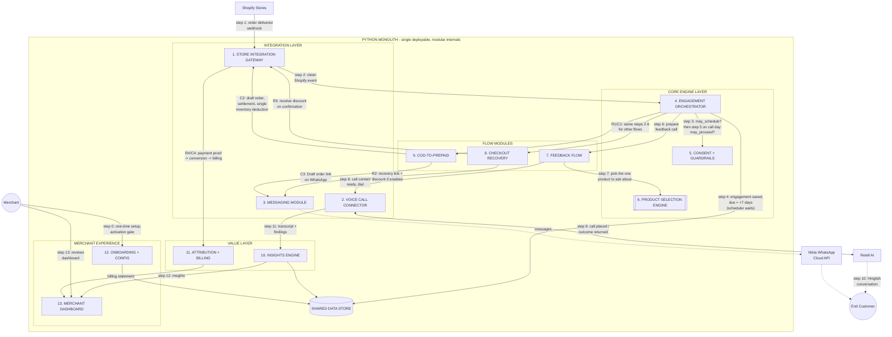
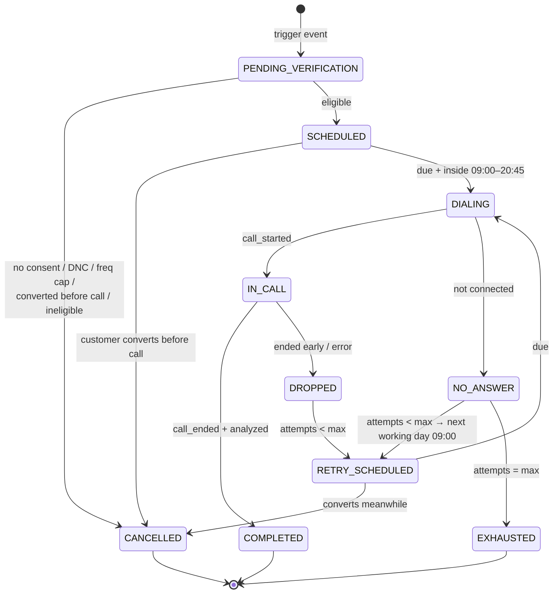

# Technical Specification — AI Voice Agent for Shopify Customer Engagement

**Status:** Draft v0.3 — trimmed for first-round HLD approval
**Owner:** TBD
**Last updated:** 2026-08-18
**Changes from v0.2:** (1) Sections 6–13 (ERD, API surface, integration details, NFRs, measurement, delivery plan, risks) removed from this document — they move into per-module tech specs after HLD approval. (2) All reviewer comments incorporated: consent mechanics clarified (covers **call + WhatsApp**, built on Shopify's extension framework), WABA onboarding simplified to **merchant-provided verified number** (no Meta embedded signup), discount codes are **resolved on customer confirmation** (pool vs on-the-fly is a Phase-0 research item), COD gateway detection explained, `app/uninstalled` rationale explained, Abandoned Checkouts REST resource referenced for reconciliation, recording-availability doubt logged, **inventory single-deduction invariant** corrected in §3.6 (COD original cancelled **with restock**). (3) New §6: module-by-module responsibilities across all three event flows, in pointer form, with SOLID/DRY rationale.

---

## 1. Context & Scope

The PRD defines three MVP flows, all one shape: **Shopify event → eligibility & scheduling → Retell voice call → follow-up actions (WhatsApp + discount / payment link) → structured outcomes → merchant insights & billing.**

The Retell workflows (the conversational layer) already exist. **This spec covers everything around them**: the Python monolith that ingests Shopify events, gates on consent, schedules and triggers calls, handles retries, executes post-call actions, extracts insights, attributes conversions, computes billing, and serves the merchant dashboard.

Out of scope: prompt design inside Retell, dashboard frontend implementation, Shopify app-store listing copy.

### 1.1 The three flows (final MVP parameters)

| Flow | Trigger | Call timing (default, per-merchant configurable) | Retries on no-answer | Frequency cap | In/post-call actions | Billable outcome |
|---|---|---|---|---|---|---|
| Abandoned Checkout | Checkout w/ phone + consent, no order after delay | 45 min after last checkout activity | 1 retry, **next working day's window** | 1 call / customer / 7 days | Understand reason → on customer confirmation, backend resolves a discount promo code → WhatsApp with personalized msg + discount URL | Discount code redeemed |
| COD → Prepaid | Order created with COD gateway | 15 min after order | 1 retry, **next working day's window** | **None** — every COD order qualifies | Confirm intent → pitch prepaid → **Shopify draft-order invoice link (carrying the discount/promo code if merchant enabled it)** via WhatsApp | Draft order paid |
| Post-Purchase Feedback | Order delivered (fulfillment event; fallback shipped+N) | **7 days** after delivery | **0 retries** | 1 call / customer / 7 days; targets **one product chosen by the Product Selection Engine** | Structured feedback only (CSAT, quality, expectations, delivery, complaints); no message sent | — (insight product, covered by flat fee) |

**Calling window:** 09:00–21:00, merchant store timezone (IST for the pilot). Hard cutoff — no dial after 20:45. Events maturing outside the window queue to the next window open. Missed-call retries and window queuing respect **working days**.
**Language:** single **Hinglish** workflow per flow. No per-customer language routing in MVP.
**Volume assumption:** < 200 calls/day at pilot. Single API service + single worker + one Postgres is sufficient.

---

## 2. Decision Log

Resolved decisions (D#) with their design consequences, followed by the open items.

### 2.1 Resolved

| # | Decision | Consequence in this spec |
|---|---|---|
| D1 | **Public OAuth Shopify app from day one** | OAuth install flow + token storage per shop; mandatory GDPR webhooks (`customers/data_request`, `customers/redact`, `shop/redact`); **Protected Customer Data approval** needed to read phone numbers — apply early, it gates everything. App review timeline added to plan. |
| D2 | **Discounts: fixed % per flow, merchant-configured, with per-merchant ON/OFF toggle** (recovery link and COD conversion) | No in-call negotiation; agent script promises exactly one offer, and only if the merchant enabled the toggle. |
| D3 | **Compliance posture: pilot with explicit checkout opt-in consent covering BOTH the voice call and the WhatsApp message** | **Reviewer question answered — "is this provided by Shopify?":** No, Shopify has no native "consent to calls" feature. Shopify provides the *framework* (Checkout UI Extensions on modern checkouts; cart/order attributes on legacy themes) and **we build the consent checkbox on it**. The captured attribute lands on the checkout/order payload, the Gateway reads it, and we store `consent_at/consent_source`. **No consent → no engagement created, no call, no WhatsApp.** DND scrub still recommended as belt-and-braces (Phase 0 legal check remains). |
| D4 | **Call timing defaults**: abandoned 45 min; COD 15 min; feedback **7 days** post-delivery — all per-merchant configurable | 7-day feedback delay gives real product-usage signal; trade-off: colder recall on delivery questions. Candidate for later A/B. |
| D5 | **Retry: next working day's window. Calling window 09:00–21:00** (store TZ) | Scheduler computes `next_action_at = next working day's window open` on no-answer; 20:45 last-dial rule; per-merchant jitter to avoid a 9 AM retry herd. |
| D6 | **Hinglish, single workflow per flow** | One Retell workflow ID per flow; language config dropped from MVP. |
| D7 | **Frequency caps per flow**: COD uncapped; abandoned 1/7d; feedback 1/7d + product selection | Cap check runs inside Consent + Guardrails at call time (§6, module 5). |
| D8 | **Pricing: flat fee + % of recovered value** (abandoned recoveries + COD conversions) | Attribution is **billing-grade**: strict rules, auditable artifacts, merchant-visible. Conversions feed a billing ledger. Per-call cost tracked internally for unit economics only. |
| D9 | **COD→prepaid via Shopify draft order / invoice link, settled by an async sanity job, with a single-inventory-deduction guarantee** | The Draft Orders API (`draftOrderCreate`; REST `POST /draft_orders.json`) returns an `invoice_url` — that is the payment link sent on WhatsApp. **Drafts hold no inventory** (never set the reserve option). On payment (webhook fast path), the COD original is **immediately cancelled WITH restock** so the new prepaid order's deduction stands and net inventory reduction is exactly once. The **async sanity job is the final authority**: every open draft ends in exactly one of {paid → COD cancelled+restocked, conversion recorded} or {expired/superseded → draft deleted, COD continues}. Expiry default 24h, merchant-configurable. |
| D10 | **Delivered detection: `fulfillment_events` (delivered), fallback shipped + N days** | Fallback N per merchant (default 5). Both paths produce the same internal `order_delivered` event. |
| D11 | **Per-merchant WABA: the merchant provides their own verified WABA number and credentials** | **Reviewer decision incorporated:** we do **not** build Meta embedded signup. Onboarding collects the merchant's verified WABA number + access credentials, we register it in our messaging layer and submit the per-flow Hinglish templates against it. Template approval per merchant per flow; a flow cannot be enabled until its template is approved. |
| D12 | **Attribution: strict** — discount-code redemption or draft-order paid, nothing else | No fuzzy 72h order-matching. Undercounts organic recoveries; every billed rupee has a hard artifact. |
| D13 | **No holdout group** | Dashboard reports recovery counts and rates, **not causal lift**. Merchants may ask "would they have returned anyway?" — strict attribution is the partial answer. An unused `is_holdout` flag is kept for painless reintroduction. |
| D14 | **Volume: < 200 calls/day pilot** | Minimal infra; no partitioning/Temporal discussions until >10k/day. |
| D15 | **DNC scope: per-merchant** | A customer opting out of store A can still be called by store B. Opt-out mid-call is honored via a live function call. |
| D16 | **One dedicated outbound number per merchant** | Number provisioning in onboarding; caller-ID consistency with the store improves answer rates; enables per-merchant business caller identity later. |
| D17 | **Feedback product selection: simple heuristic — order value + recency** | `score = w1·normalized_line_item_value + w2·recency_decay(delivered_at)` over the customer's delivered items in the last 30 days; top product becomes the call subject; the ranked decision is recorded for auditability and future model training. Contract-first black box (§6, module 6). |
| D18 | **Cost accounting: internal only** | Per-call cost tracked for unit economics; never billed to merchants. |
| D19 | **Discount codes are resolved only on customer confirmation, mid-call** | **Reviewer correction incorporated:** no code exists before the customer says yes. The agent takes confirmation → fires one backend function call → the backend **resolves** a promo code — either fetched from a pre-provisioned per-merchant pool in our DB or created on the fly via Shopify — and sends the personalized WhatsApp. Which sourcing strategy (pool vs on-the-fly) is a Phase-0 research item (§2.2-6) driven by the <2s mid-call latency budget. |

### 2.2 Open items (Phase 0; none block the HLD)

1. **AI + recording disclosure wording** — reviewer flag retained: the actual legal requirement/flow is **unknown**; Phase-0 action is a legal consult on (a) whether AI disclosure is mandatory, (b) whether call-recording consent must be spoken. Until answered, assume both required and script the opening line accordingly.
2. **What call media does Retell actually expose?** — reviewer doubt logged: transcript is confirmed available; whether a **recording/recording URL** is provided (and its TTL) must be verified against our Retell plan. Retention durations (proposal: transcript 1 year; recording, if available, 90 days) to be decided after that check.
3. **COD gateway detection — clarified for the reviewer:** when an order is placed, the Shopify order payload carries the payment method in `gateway` / `payment_gateway_names`. The *string values differ per store setup* — e.g. `"Cash on Delivery (COD)"`, `"cash_on_delivery"`, a renamed manual payment method, or a COD app's own gateway name. The open task: collect the actual values from each pilot merchant's store and maintain a per-merchant mapping of "which gateway strings mean COD," otherwise the COD flow either misses orders or fires on prepaid ones.
4. **Retell plan concurrency limit** — measure; dialer throttle set below it.
5. **Consent capture UX** — the checkbox must clearly cover **both the voice call and the WhatsApp message** (single combined consent). Implementation depends on merchant checkout type: Checkout UI Extension (modern) vs cart-attribute snippet (legacy). Wording + placement to be finalized with legal input from item 1.
6. **Discount code sourcing (from D19)** — research on a dev store: latency and limits of on-the-fly `discountCodeBasicCreate` vs a pre-provisioned pool of single-use codes held in our DB and personalized at send time. Decision driver: <2s mid-call function budget and code hygiene (single-use, customer-scoped, expiring).
7. **Invoice cadence & revenue-share %** — commercial; needed before billing UI.
8. **Draft-order edge cases** — shipping charges, COD fees, partial payments, discount interaction (validate on a dev store).
9. **Abandoned Checkouts REST resource validation** — verify on a dev store the exact behavior of Shopify's [Abandoned Checkouts resource](https://shopify.dev/docs/api/admin-rest/latest/resources/abandoned-checkouts) (visibility delay, pagination, dedup fields) as the **reconciliation/pull source** described in §3.1.

---

## 3. Approach Analysis — Key Design Decisions

### 3.1 Event detection: hybrid webhooks + reconciliation

Webhooks are primary: `checkouts/create|update`, `orders/create|paid|cancelled`, `fulfillments/update`, `fulfillment_events/create`, `app/uninstalled`, plus the three mandatory GDPR topics. Shopify fires **no "checkout abandoned" webhook** — abandonment is *derived*: on checkout activity we schedule a check at `T + delay`; when it fires we verify no order exists for the checkout token. `orders/create` cancels any pending abandoned-checkout engagement for its token — and, for COD orders, *creates* a COD engagement in the same handler.

**Reviewer question — why subscribe to `app/uninstalled`?** Because uninstall is an event we must react to immediately: (a) **stop everything** — cancel all pending engagements for that merchant so no customer of an ex-merchant ever gets called; (b) **compliance** — Shopify requires purging shop data after uninstall (the `shop/redact` webhook follows ~48h later; `app/uninstalled` lets us freeze activity instantly rather than waiting); (c) **billing** — close the ledger period. Without it, a merchant who uninstalls at 9 AM could still have customers receiving calls at 2 PM.

**Reviewer pointer — Shopify's Abandoned Checkouts resource:** correct, and it is already in the design as the **safety-net pull source**: the REST Abandoned Checkouts endpoint (`GET /checkouts.json`) lists checkouts with contact info that were never completed. It is a *pull* API (no push), surfaces checkouts only after a delay, and therefore serves reconciliation — a 15–30 min poller that diffs Shopify's list against our records and emits any `CheckoutAbandoned` we missed to dropped webhooks. Exact field/paging behavior is Phase-0 item §2.2-9. Primary detection remains webhook-derived because it is near-real-time (a 45-min call delay demands fresher signal than the pull API guarantees).

### 3.2 Scheduling & orchestration: Postgres state machine + worker queue

Postgres is the source of truth (`engagements.state`, `next_action_at`); a scheduler tick claims due rows exclusively and pushes execution to workers. Cancellation = row update. Long-delay timers (the 7-day feedback wait!) live in the DB, not in broker ETAs — this is exactly the case where broker-based delays go wrong. Portable to Temporal later without data-model changes. At <200 calls/day (D14) a 30s tick is more than enough.

**Window math (D5):** engagements maturing outside 09:00–21:00 store time get `next_action_at = next working day's window open`. No-answer retry → next working day 09:00 plus per-merchant jitter.

### 3.3 Discount promo codes: resolved on confirmation, mid-call (rewritten per D19)

The corrected flow, applying to both abandoned-checkout and COD conversations:

1. The agent conducts the conversation; **only when the customer explicitly agrees** (to complete the purchase / to pay online) does it fire a single backend function call (`create-discount` / `create-payment-link`) carrying the engagement reference.
2. The backend **resolves** the promo code: either fetched from a pre-provisioned per-merchant pool in our DB or created on the fly via Shopify's discount API — the sourcing strategy is Phase-0 research (§2.2-6), constrained by the <2s in-call budget. Either way the code is single-use, customer-scoped, and expiring.
3. The backend enqueues the **personalized WhatsApp message** (customer name, item/order, discount, link) and returns an immediate ack the agent can speak ("I've just sent it to your WhatsApp").
4. If the function fails mid-call, the post-call handler retries the resolution + send so the promise made on the call is always kept.

Codes existing **only after a yes** matters twice over: it keeps redemption a clean *billing event* (D8, D12), and it prevents code leakage/waste on unanswered or unwilling calls.

### 3.4 Insight extraction: two layers

Layer 1 — Retell post-call structured fields per workflow (operational signal, drives actions). Layer 2 — our own async LLM pass over the transcript producing merchant-facing insights with a stable taxonomy, re-runnable/backfillable. Hinglish transcripts (D6) are handled fine by the Layer-2 model; taxonomy labels stay English.

### 3.5 WhatsApp: Meta Cloud API, merchant-provided WABA (updated per D11)

The merchant **provides their own verified WABA number and credentials** during onboarding — we do not build or operate Meta embedded signup. Our messaging layer keys every send by `merchant → waba_id, phone_number_id, token`, submits the per-flow Hinglish templates against the merchant's WABA, tracks approval status, and **gates flow enablement on template approval**. The D3 consent (call + WhatsApp combined) satisfies WhatsApp's opt-in expectation.

### 3.6 COD→prepaid mechanics: Shopify draft order + async settlement (corrected per D9)

When the customer agrees on-call, the agent fires the payment-link function: we create a **draft order** mirroring the COD order (line items, shipping, merchant-toggled discount applied, COD fee removed) via `draftOrderCreate` and send its **`invoice_url`** on WhatsApp. **Drafts hold no inventory** — the reserve option is never set, so during the whole waiting window only the COD order holds stock.

Settlement is owned by an **async sanity job** (payment webhooks are just the fast path). Every open draft terminates in exactly one of two states:

- **Paid within the expiry window (default 24h):** the completed order deducts stock → we **immediately cancel the original COD order WITH restock**, returning its deduction — net inventory reduced exactly once; both orders tagged and cross-linked; conversion recorded with proof (billing event).
- **Not paid, or the COD original was cancelled/shipped meanwhile:** the draft is deleted (it never held inventory); the COD order continues unchanged.

The **single-inventory-deduction invariant**, stated once: *at every instant, exactly one order holds the stock — the COD order from placement until draft payment; the prepaid order from the moment cancellation-with-restock lands; the draft never.* Phase-0 dev-store test asserts it end-to-end (§2.2-8).

*Rejected alternatives:* external payment link (Razorpay) — clean UX but manual reconciliation to Shopify order state and weaker billing-grade attribution; cancel-and-recreate before payment — customer may pay nothing and the original order is already gone.

### 3.7 One generic engine, config-driven flows

Per-merchant, per-flow configuration: Retell workflow ID, delay, retries, window, working days, discount toggle + %, WhatsApp template, selection weights (feedback), draft-order expiry (COD). A future fourth flow (e.g., NDR/failed-delivery calls) is configuration + one new flow module — nothing in the core engine changes.

---

## 4. High-Level Design

### 4.1 Component overview (the monolith's module map)

### 4.2 Flow journey (behavioral flowchart, all three events)

```mermaid
flowchart LR
    subgraph P1["PHASE 1 - MERCHANT ONBOARDING (shared, one-time)"]
        direction TB
        A1["Merchant installs app<br/>via Shopify"] --> A2["Save store credentials +<br/>subscribe to store events<br/>incl. data-privacy compliance"]
        A2 --> A3["Merchant provides business profile<br/>+ their own verified WABA number<br/>and credentials"]
        A3 --> A4["Register merchant's WABA +<br/>approve message templates<br/>(one per flow)"]
        A3 --> A5["Assign dedicated<br/>outbound calling number"]
        A5 --> A6["Set up voice workflows in Retell<br/>(one per flow)<br/>on the merchant's number"]
        A7["Merchant configures each flow:<br/>timings, frequency caps,<br/>discount toggle ON/OFF + %<br/>(recovery link and COD conversion),<br/>draft order expiry, calling hours,<br/>working days"] --> AG
        A4 --> AG{"ACTIVATION GATE per flow:<br/>store connected, number assigned,<br/>template approved,<br/>workflow ready"}
        A6 --> AG
        AG -- all ready --> A8["Merchant ACTIVE -<br/>enabled flows go live"]
        AG -- anything pending --> A9["Not active yet -<br/>pending items shown<br/>to merchant"]
    end

    subgraph P2["PHASE 2 - EVENT DETECTION TO SCHEDULING"]
        direction TB
        B1["Store event received<br/>from Shopify"] --> B2["Validate and record<br/>the event"]
        B2 --> B3{"Event type?"}
        B3 -- "order delivered" --> B4["Identify customer +<br/>capture delivered products"]
        B4 --> B5["Schedule feedback call:<br/>7 days after delivery,<br/>working day, calling window"]
        B3 -- "checkout started with<br/>contact info, not completed" --> B6["Wait out abandonment window<br/>(default 45 min)"]
        B6 --> B7{"Purchase completed<br/>on its own meanwhile?"}
        B7 -- yes --> B8["No call needed -<br/>checkout self-recovered"]
        B7 -- no --> B9["Confirmed abandoned checkout -<br/>schedule recovery call<br/>within calling window"]
        B3 -- "order placed with<br/>Cash on Delivery" --> B11["Schedule COD conversion call:<br/>15 min after order,<br/>within calling window -<br/>every COD order qualifies"]
        B10["Safety net: periodically pull<br/>abandoned checkouts from Shopify<br/>to catch missed events"] -.-> B9
    end

    subgraph P3["PHASE 3 - CALL DAY: ELIGIBILITY + PREPARATION"]
        direction TB
        C1["Due calls picked up"] --> C2{"Eligibility checks:<br/>customer consented (call + WhatsApp),<br/>not on do-not-call list,<br/>flow cap honoured<br/>(feedback + abandoned: 1 per 7d,<br/>COD: no cap)"}
        C2 -- fail --> C3["Call cancelled,<br/>reason recorded"]
        C2 -- pass --> C6{"Still relevant?<br/>abandoned: purchase not completed,<br/>COD: order still active,<br/>not cancelled or shipped"}
        C6 -- no longer relevant --> C3
        C6 -- yes --> C7{"Which flow?"}
        C7 -- feedback --> C4[["PRODUCT SELECTION ENGINE<br/>in: customer's recent deliveries<br/>(calls x carts x products)<br/>out: the one product<br/>to collect feedback on"]]
        C4 --> C5["Selected product recorded<br/>against the scheduled call"]
        C7 -- abandoned checkout --> C8["Cart contents + checkout<br/>recovery link prepared,<br/>discount applied if merchant<br/>enabled the toggle"]
        C7 -- COD conversion --> C9["COD order details prepared:<br/>items, amount, discount if<br/>merchant enabled the toggle"]
    end

    subgraph P4["PHASE 4 - CALL + OUTCOME"]
        direction TB
        D1["AI call placed from the<br/>merchant's number, personalised<br/>with customer, product, cart<br/>or order details"] --> D2(("Customer"))
        D2 --> D3{"Answered?"}
        D3 -- "no - feedback" --> D4["Marked missed -<br/>feedback calls not retried,<br/>no message sent"]
        D3 -- "no - abandoned or COD" --> D10{"First attempt?"}
        D10 -- yes --> D11["One retry scheduled for<br/>next working day,<br/>no message sent meanwhile"]
        D10 -- no --> D12["Marked missed -<br/>attempts exhausted,<br/>no message sent"]
        D3 -- yes --> D13{"Which flow?"}
        D13 -- feedback --> D5["Feedback conversation:<br/>satisfaction, product quality,<br/>expectations vs reality,<br/>delivery experience, complaints"]
        D13 -- abandoned --> D14["Understand reason<br/>for abandoning checkout"]
        D14 --> D15{"Willing to complete<br/>the purchase?"}
        D15 -- yes --> D16["Backend resolves promo code<br/>on confirmation - recovery link<br/>(discount if enabled) sent to<br/>customer's WhatsApp during the call"]
        D15 -- no --> D6
        D13 -- COD conversion --> D20["Confirm order intent +<br/>explain benefits of<br/>paying online"]
        D20 --> D21{"Agrees to pay online?"}
        D21 -- yes --> D22["Draft order created mirroring<br/>the COD order: items, shipping,<br/>discount if enabled, COD fee removed -<br/>draft holds NO inventory,<br/>stock stays with the COD order"]
        D22 --> D23["Draft order payment link<br/>sent to customer's WhatsApp<br/>during the call"]
        D21 -- no --> D6
        D23 --> D6["Call outcome received:<br/>transcript + structured findings"]
        D16 --> D6
        D5 --> D6
        D19["Any opt-out request honoured -<br/>customer added to<br/>do-not-call list"] -.-> D6
        D6 --> D7[("Outcome saved")]
        D7 --> D8["Engagement complete +<br/>insights on merchant dashboard"]
    end

    subgraph P5["PHASE 5 - CONVERSION SETTLEMENT (async)"]
        direction TB
        E1["Customer completes checkout<br/>via recovery link"] --> E2["Recovery recorded with proof -<br/>feeds billing (revenue share)"]
        E3["Sanity job checks every<br/>open draft order until settled<br/>(payment events as fast path)"] --> E4{"Draft order paid<br/>within expiry window<br/>(default 24h)?"}
        E4 -- paid --> E5["Immediately cancel original<br/>COD order with stock returned -<br/>new prepaid order keeps its<br/>deduction, so inventory is<br/>reduced exactly once -<br/>both orders tagged + cross-linked"]
        E5 --> E6["COD conversion recorded with<br/>proof - feeds billing<br/>(revenue share)"]
        E4 -- "not paid, or COD order<br/>cancelled or shipped meanwhile" --> E7["Draft order deleted -<br/>no inventory ever held by it -<br/>original COD order<br/>continues unchanged"]
    end

    A8 ==> B1
    B5 ==> C1
    B9 ==> C1
    B11 ==> C1
    C5 ==> D1
    C8 ==> D1
    C9 ==> D1
    D11 -.-> C1
    D16 -.-> E1
    D23 -.-> E3
```

---

## 5. Engagement State Machine

`max_attempts`: abandoned=2, COD=2, feedback=1 (config). Invariants: every transition logged with reason; cancellation races handled by re-checking state inside the exclusive dialing claim; post-call actions tracked independently of call state; one engagement per (merchant, flow, source) enforced by uniqueness.

---

## 6. Module Responsibilities — Per Unit, Per Event Flow

This section replaces the removed low-level sections for first-round review. Each of the 13 modules gets: its single purpose, its responsibilities in points, and **how it behaves in each of the three event flows** with examples. Each module here becomes its own tech spec after HLD approval.

**Design conventions applied throughout (read once, they repeat in every module):**

- **SRP (Single Responsibility):** every module has exactly one reason to change — e.g., the Gateway changes only when Shopify's API changes, Guardrails only when a calling rule changes.
- **OCP (Open/Closed):** the core engine (modules 4–5) is closed to modification but open to extension — a fourth event flow is a *new* flow module, not an edit to existing ones.
- **LSP (Substitutability):** all flow modules (7–9) implement the same flow-module contract (`prepare_call()`, `handle_outcome()`, `on_confirmation_function()`), so the Orchestrator treats any flow identically.
- **ISP (Interface Segregation):** modules expose narrow, question-shaped interfaces (Guardrails answers one question; PSE answers one question) instead of fat APIs.
- **DIP (Dependency Inversion):** business modules depend on abstractions (`StoreGateway`, `VoiceConnector`, `Messenger`), never on Shopify/Retell/Meta SDKs directly — providers are swappable behind interfaces.
- **DRY:** anything two flows both need (scheduling, eligibility, calling, messaging, persistence, settlement patterns) lives once in a shared module; flow modules contain **only** what is unique to their flow.

---

### Module 1 — Store Integration Gateway

**Purpose:** the only door between the system and Shopify — events in, actions out. *(SRP: changes only when Shopify changes. DIP: everyone else sees a `StoreGateway` interface, never Shopify JSON.)*

**Core responsibilities:**
- Verify authenticity of every inbound Shopify webhook; drop duplicates; append every raw payload to a replayable event log before any processing.
- Translate raw payloads into small internal domain events: `OrderDelivered`, `CheckoutActivity`, `OrderPlaced(payment_method)`, `OrderCancelled`, `MerchantUninstalled`, `CustomerErasureRequested`.
- Execute every outbound store action requested by other modules, behind per-store rate limiting and idempotency: resolve/create discount codes, create draft orders (never reserving inventory), cancel orders with restock, tag orders, write timeline notes.
- Run the reconciliation poller (Abandoned Checkouts pull API, §3.1) to repair missed webhooks.
- Manage webhook subscriptions and store credentials over the merchant lifecycle (install/uninstall).

**Per-flow behavior:**
- *Feedback:* consumes `fulfillment_events (delivered)` → emits `OrderDelivered` with customer + delivered line items. Example: order #1001 delivered → clean event handed to the Orchestrator; the Gateway neither knows nor cares that a call happens 7 days later.
- *Abandoned checkout:* consumes `checkouts/create|update` → emits `CheckoutActivity`; consumes `orders/create` → emits `OrderPlaced` (which the Orchestrator uses to cancel pending recovery engagements); on request, resolves the promo code (D19) and builds the recovery URL; the reconciliation poller backstops missed abandonments.
- *COD→prepaid:* detects COD via the per-merchant gateway-string mapping (§2.2-3) on `OrderPlaced`; on request, creates the mirroring draft order (no inventory reserve) and returns its `invoice_url`; at settlement, executes cancel-with-restock + tag + cross-link as one logical action; reports draft-order payment as proof to Attribution.

---

### Module 2 — Voice Call Connector

**Purpose:** the only door to Retell — places calls, hosts live in-call functions, receives outcomes. *(SRP + DIP: swap Retell for another voice provider = rewrite this module only.)*

**Core responsibilities:**
- Place outbound calls with the flow's workflow ID, the merchant's dedicated number, and personalization variables handed over by the flow module.
- Host the low-latency (<2s) in-call function endpoints the agent fires mid-conversation: resolve-discount, create-payment-link, mark-do-not-call, schedule-callback — each delegated to the owning module, acknowledged immediately so the agent can speak ("sent to your WhatsApp").
- Receive call outcomes (answered/missed, duration, transcript, structured findings) and hand them to the Orchestrator; verify webhook authenticity.
- Enforce the dialer throttle below the Retell plan's concurrency limit.
- Report per-call cost estimates for internal unit economics (D18).

**Per-flow behavior:**
- *Feedback:* dials with variables {customer, target product, order ref}; no in-call functions expected; returns CSAT/quality/delivery findings.
- *Abandoned checkout:* dials with {customer, cart summary, discount % if toggled}; on customer confirmation the agent fires resolve-discount → Connector delegates to the Checkout Recovery module and acks; returns abandonment-reason findings.
- *COD→prepaid:* dials with {customer, order ref, amount, discount if toggled}; on agreement the agent fires create-payment-link → delegated to the COD module; returns intent/agreement findings. Example: customer says yes at second 95 of the call → function fires → ack in 1.4s → agent says "link is on your WhatsApp now."

---

### Module 3 — Messaging Module

**Purpose:** the only door to WhatsApp — template sends through each merchant's own WABA, delivery tracking. *(DIP: `Messenger` interface; a future SMS/RCS channel is a new adapter, zero flow changes.)*

**Core responsibilities:**
- Send only pre-approved template messages, keyed per merchant (merchant-provided WABA number + credentials, D11).
- Enforce "no approved template → no send"; surface template approval status to Onboarding's activation gate.
- Track message lifecycle (sent/delivered/read/failed) from provider callbacks; log inbound replies (no auto-reply in MVP).
- Never decide *whether* to message — only flows may request a send, and only after an on-call yes (no fallback messages on missed calls, by decision).

**Per-flow behavior:**
- *Feedback:* **sends nothing** — by design this flow is call-only.
- *Abandoned checkout:* sends the personalized recovery template {name, items, discount if enabled, recovery URL} during the call, on the flow module's request.
- *COD→prepaid:* sends the payment-link template {name, order ref, amount, invoice URL} during the call. Example: send fails because the merchant's WABA token expired → failure logged, post-call retry path triggers, Onboarding is flagged to refresh credentials.

---

### Module 4 — Engagement Orchestrator

**Purpose:** owns every engagement from birth to terminal state — the only module that decides *what happens next and when*. *(SRP: knows lifecycle + time + policy, nothing else. OCP: new flows plug in without touching it.)*

**Core responsibilities:**
- Turn Gateway domain events into engagements (or cancellations of existing ones), applying flow config: delays, working days, calling windows, retry policy.
- Own the state machine (§5) exclusively — no other module may transition an engagement.
- Run the scheduler tick; claim due engagements **exclusively** so double-dialing is structurally impossible.
- Execute the fixed pre-flight sequence: ask Guardrails → ask the flow module to prepare → hand to the Voice Connector.
- Interpret outcomes per flow policy (retry vs exhausted vs completed) and record every transition with reason for audit.

**Per-flow behavior:**
- *Feedback:* `OrderDelivered` → engagement due delivery+7d on a working day in window; missed call → exhausted immediately (0 retries). Example: delivered 11 Aug 6:40 PM → due 18 Aug, but Sunday → due 19 Aug 09:00.
- *Abandoned checkout:* `CheckoutActivity` → abandonment check at +45 min; `OrderPlaced` for the same checkout at any pre-call moment → cancelled (self-recovered); missed → one retry next working day.
- *COD→prepaid:* `OrderPlaced(COD)` → due +15 min; no frequency cap (every COD order); missed → one retry next working day; `OrderCancelled` before the call → cancelled (no longer relevant).

---

### Module 5 — Consent + Guardrails

**Purpose:** answers exactly one question — "may this call happen, to this customer, right now?" — and owns the data that answers it. *(ISP: one question in, one verdict out. Separated so no flow can bypass it and every rule changes in one place.)*

**Core responsibilities:**
- Own the consent registry (checkout opt-in covering **call + WhatsApp**, D3): record, verify, honor erasure.
- Own the per-merchant do-not-call list; accept mid-call opt-outs reported by the Voice Connector.
- Enforce per-flow frequency caps, calling window/working-day legality, and last-moment relevance re-checks.
- Return enumerated verdicts (approved / denied+reason) so the Orchestrator can act mechanically; log every verdict with evidence for the compliance trail.
- Consulted twice per engagement (DRY — checks written once, applied to all flows): a cheap screen at creation, the authoritative verdict at call time.

**Per-flow behavior:**
- *Feedback:* verifies consent, DNC, and the 1-per-7-days cap. Example: two orders delivered a day apart create two engagements; the second hits the cap → denied (frequency_cap) → cancelled with reason.
- *Abandoned checkout:* same checks + relevance ("has this checkout converted to an order?") → denied (no_longer_relevant) if yes.
- *COD→prepaid:* consent + DNC (no cap by decision) + relevance ("is the COD order still active — not cancelled, not shipped?").

---

### Module 6 — Product Selection Engine

**Purpose:** a contract-first black box: given a customer's recent deliveries (calls × carts × products), return **the one product** to collect feedback on, with a score. *(OCP/LSP: v1 heuristic is swappable for an ML ranker under the identical contract; nothing else moves.)*

**Core responsibilities:**
- Rank candidates by the v1 heuristic: order value + recency decay (weights configurable per merchant).
- Return `{target_product, score}`; persist the **full ranked list** with scores — audit trail and future training data.
- Stay deterministic per engagement: selection happens once, at call time, and is recorded before dialing.

**Per-flow behavior:**
- *Feedback:* the only consumer in MVP. Example: Priya received shoes (₹2,999, 7 days ago) and socks (₹399, 9 days ago) → shoes score highest → the call asks about shoes; the ranked decision is stored so a merchant asking "why shoes?" gets an answer.
- *Abandoned checkout / COD:* **not used** — deliberately; those calls are about a cart/order, not a product choice. (Future: could rank talking points; out of scope.)

---

### Module 7 — Feedback Flow Module

**Purpose:** everything unique to the post-purchase feedback journey. *(DRY: borrows scheduling, eligibility, calling, persistence from the core; contains only feedback-specific logic.)*

**Core responsibilities:**
- Define the trigger reaction: `OrderDelivered` → request an engagement at +7 days (working day, window).
- At call time, invoke the Product Selection Engine and attach the chosen product to the call content.
- Define call personalization variables and the expected structured findings (CSAT, quality, expectations vs reality, delivery, complaints).
- Policy: 0 retries, no messaging ever, 1-per-customer-per-7-days cap.
- Hand outcomes to the Insights Engine; no conversions, no billing artifacts.

**Example end-to-end:** delivery Tuesday → engagement due next Tuesday 09:00 → Guardrails approves → PSE picks the shoes → call collects CSAT 2/5 with "size runs small" → insight lands on the dashboard tagged to that product.

---

### Module 8 — Checkout Recovery Module

**Purpose:** everything unique to the abandoned-checkout journey.

**Core responsibilities:**
- Define abandonment derivation: on `CheckoutActivity`, request the +45 min confirmation check; treat `OrderPlaced` for the same checkout as self-recovery (cancel).
- At call time, prepare cart summary + recovery link; apply the discount **only if the merchant's toggle is ON**.
- Own the on-confirmation function (D19): customer says yes → resolve promo code via the Gateway (pool or on-the-fly, §2.2-6) → request the WhatsApp send → return the spoken ack. Post-call retry if the mid-call resolution failed — a promise made on-call is always kept.
- Policy: 1 retry next working day; 1-per-customer-per-7-days cap; **nothing sent on missed or unwilling calls**.
- Register the expected proof (code redemption → recovered order) with Attribution.

**Example end-to-end:** Ravi abandons a ₹4,500 cart at 2 PM → confirmed abandoned 2:45 PM → call at 2:47 PM → reason: "shipping felt high" → agrees on a 10% code → code resolved + WhatsApp sent mid-call → Ravi completes checkout at 6 PM with the code → conversion recorded with the order ID as proof → revenue share accrues.

---

### Module 9 — COD-to-Prepaid Module

**Purpose:** everything unique to converting COD orders to prepaid — the highest-operational-risk flow, so it also owns settlement.

**Core responsibilities:**
- Define the trigger reaction: `OrderPlaced(COD)` (per-merchant gateway mapping, §2.2-3) → engagement at +15 min; every COD order qualifies (no cap).
- At call time, prepare order details + discount if toggled.
- Own the on-agreement function: create the mirroring draft order via the Gateway (**no inventory reserve — the invariant of §3.6 starts here**), send the `invoice_url` on WhatsApp, return the spoken ack.
- Own the **async settlement job** (final authority; payment webhooks are the fast path): paid within expiry → cancel COD original **with restock** (single inventory deduction), tag + cross-link, record conversion with proof; unpaid/expired/superseded (COD cancelled or shipped meanwhile) → delete the draft, COD continues.
- Guarantee every draft terminates in exactly one of the two settlement outcomes — no zombie drafts.

**Example end-to-end:** ₹1,499 COD order 11:00 → call 11:15 → customer agrees → draft order (5% off, COD fee removed) → link on WhatsApp → paid 11:32 → new prepaid order deducts stock, COD original cancelled with restock seconds later → net inventory −1 → conversion recorded → revenue share accrues. Counter-example: not paid by 11:15 next day → draft deleted, COD order ships as normal, no billing entry.

---

### Module 10 — Insights Engine

**Purpose:** turn raw call outcomes into merchant-facing value. *(SRP: analysis only — never triggers operational actions.)*

**Core responsibilities:**
- Consume transcripts + structured findings; run the async Layer-2 LLM pass into a **stable taxonomy** (English labels over Hinglish transcripts).
- Produce per-call insight records: primary reason, sentiment, CSAT, intent, issue tags, verbatim quotes, 2–3 sentence summary; version the model used.
- Be re-runnable/backfillable over stored transcripts when the taxonomy improves — no re-calling customers.

**Per-flow behavior:**
- *Feedback:* the main event — product/delivery issue extraction, CSAT trends per product. Example: 12 of 30 shoe-feedback calls tag "size runs small" → surfaced as the product's top issue.
- *Abandoned checkout:* abandonment-reason taxonomy (price, shipping cost, payment trouble, comparison shopping…) → the merchant's "why we lose checkouts" chart.
- *COD→prepaid:* decline reasons (trust, cash preference, past bad experience) → informs merchants' prepaid incentives.

---

### Module 11 — Attribution + Billing Ledger

**Purpose:** the money module — recognize conversions only from hard artifacts and keep a merchant-auditable ledger. *(SRP: billing-grade correctness is its only concern.)*

**Core responsibilities:**
- Recognize exactly two conversion proofs (D12): recovery **code redeemed** (order carrying the code) and **draft order paid** (completed order ID). Nothing fuzzy.
- Write ledger entries: monthly flat fee + one revenue-share entry per conversion; reverse entries on refunds of attributed orders.
- Enforce exactly-once billing (a proof artifact can convert only once).
- Serve the self-explanatory billing statement: every billed rupee → order ID + artifact.

**Per-flow behavior:**
- *Feedback:* no conversions — covered by flat fee only.
- *Abandoned checkout:* Gateway reports an order redeeming code SAVE10-RAVI → conversion (recovered_checkout, ₹4,050) → revenue-share entry.
- *COD→prepaid:* settlement reports draft paid → conversion (cod_prepaid, ₹1,424) → revenue-share entry. Example dispute: merchant questions a charge → statement shows order #1042 + code artifact → resolved by pointing, not arguing.

---

### Module 12 — Onboarding + Configuration

**Purpose:** everything between "merchant found us" and "flows live," guarded by the activation gate.

**Core responsibilities:**
- Run the Shopify OAuth install; trigger webhook registration via the Gateway; store credentials.
- Collect the merchant's **own verified WABA number + credentials** (D11 — no embedded signup); register with Messaging; submit per-flow templates and track approval.
- Provision the dedicated outbound number; bind per-flow Retell workflows to it.
- Capture per-flow configuration: delays, caps, discount toggles + %, draft-order expiry, calling hours, working days, selection weights.
- Enforce the **activation gate per flow**: store connected ∧ number assigned ∧ template approved ∧ workflow bound — nothing goes live missing any dependency; show pending items to the merchant.
- Handle uninstall: freeze all activity immediately (via the Orchestrator), schedule data purge, close the billing period.

**Per-flow behavior:** identical machinery (DRY); differs only in which template/workflow/config set gates which flow. Example: feedback template approved but recovery template rejected → feedback flow goes live, recovery stays visibly blocked with the rejection reason.

---

### Module 13 — Merchant Dashboard

**Purpose:** the read side of the entire system — owns no state, presents everything. *(SRP: presentation only; CQRS-flavored — it reads what other modules wrote.)*

**Core responsibilities:**
- Engagement funnel per flow: eligible → called → connected → completed → converted, with cancellation reasons broken out (Guardrails' enumerated reasons become chart categories).
- Call records: timeline, transcript, structured findings, insights, actions taken.
- Insight aggregates: abandonment-reason taxonomy, per-product CSAT and issue trends, COD decline reasons.
- Money views: recovered revenue, COD→prepaid rate, and the billing statement (labeled *attributed*, not incremental lift — D13).
- Configuration surface: flow settings, DNC management, onboarding/pending-activation status.

**Per-flow behavior:**
- *Feedback:* product-level insight views. Example: merchant filters shoes → sees CSAT trend + "size runs small" quotes → fixes the size chart.
- *Abandoned checkout:* recovery funnel + reasons + recovered revenue with proof links.
- *COD→prepaid:* conversion rate, settlement outcomes, decline reasons.

---

### 6.1 Cross-cutting summary — who does what, per event (one-glance matrix)

| Module | Feedback | Abandoned Checkout | COD→Prepaid |
|---|---|---|---|
| 1 Gateway | delivered event in | checkout activity in, code resolution + reconciliation | COD detection, draft order, cancel-with-restock |
| 2 Voice Connector | dial + findings | dial + on-confirmation function | dial + on-agreement function |
| 3 Messaging | — (call-only) | recovery template mid-call | payment-link template mid-call |
| 4 Orchestrator | +7d, 0 retries | +45 min check, 1 retry, cancel on self-recovery | +15 min, 1 retry, cancel on order cancel |
| 5 Guardrails | consent+DNC+cap | + relevance (converted?) | consent+DNC+relevance, no cap |
| 6 PSE | picks the product | — | — |
| 7/8/9 Flow module | owns journey | owns journey + code promise | owns journey + settlement |
| 10 Insights | CSAT/product issues | abandonment reasons | decline reasons |
| 11 Attribution+Billing | — (flat fee) | code redemption proof | draft-paid proof |
| 12 Onboarding | gates flow | gates flow | gates flow |
| 13 Dashboard | product insights | recovery funnel + revenue | conversion + settlement views |

---

## 7. Spec Status & Next Steps

This document is the **first-round approval package**: context, decisions, approach analysis, both HLD diagrams, the state machine, and module responsibilities. The removed v0.2 sections (ERD, API surface, integration details, NFRs, measurement & billing detail, delivery plan, risks) are not lost — they graduate into **per-module tech specs** written after this HLD is approved, in the build order: Gateway (1) → Orchestrator + Guardrails (4, 5) → Onboarding (12) → Feedback + PSE (7, 6) → Voice Connector (2) → Insights (10) → Dashboard (13) → Checkout Recovery (8) → COD-to-Prepaid (9) → Attribution + Billing (11). Phase-0 items in §2.2 run in parallel with the first module specs.
